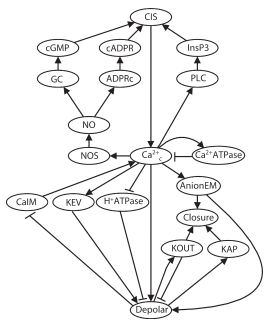
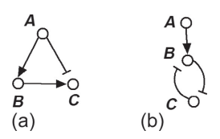
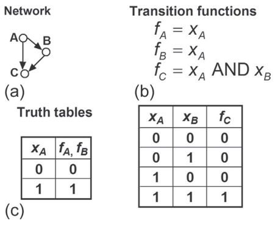
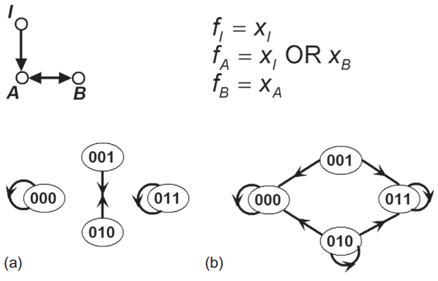

### Ejercicio 4.1 



1.  ¿La red está fuertemente conectada? Explica tu respuesta. 
    No está fuertemente conectada porque tiene una densidad de conexiones del 8%, tiene solamente el 8% de conexiones que pudiera tener la red completa.
    
    $$\begin{array}{l}
    = n(n-1) \\
    = 19(19-1) \\
    = 19(18) = 342 \\
    \\
    D = \frac{\#edges}{n(n-1)} \\
    D = \frac{28}{342} \\
    D = 0.081 * 100 \% = 8\%
    \end{array}$$
<p>&nbsp;</p>
2.  Si la red no está fuertemente conectada, identifique sus componentes fuertemente conectados.

    El Ca$^{2+}$ con la Ca$^{2+}$ATPase, ya que tiene el total de conexiones que pudiera tener un subgrafo de dos nodos.
    $$\begin{array}{l}
    = n(n-1) \\
    = 2(2-1) \\
    = 2(1) = 2 \\
    \\
    D = \frac{\#edges}{n(n-1)} \\
    D = \frac{2}{2} \\
    D = 1 * 100\% = 100\%
    \end{array}$$
    <p>&nbsp;</p>
    También está Ca$^{2+}$ con Depolar y AnionEM, que tienen el 50% de conexiones para el subgrafo de 3 nodos. 
    $$\begin{array}{l}
    = n(n-1) \\
    = 3(3-1) \\
    = 3(2) = 6 \\
    \\
    D = \frac{\#edges}{n(n-1)} \\
    D = \frac{3}{6} \\
    D = 0.5 * 100\% = 50\%
    \end{array}$$
<p>&nbsp;</p>

3.  ¿La red contiene bucles? Si es así, identifíquelos.

    Todas las conexiones que llegan al nodo de closure. 

4.  ¿La red contiene ciclos? Si es así, identifique todos los ciclos.

    -   El ciclo de activación entre Ca$^{2+}$ - PLC - InsP3 - CIS
    -   El ciclo de activación de Ca$^{2+}$ hacia NOS, que a final de cuentas, va a terminar activando Ca$^{2+}$.

5.  ¿Existen bucles de realimentación? Si es así, identifíquelos como positivos, negativos o incoherentes.

6.  ¿Hay circuitos de retroalimentación? Identifícalos. Identifica su signo como positivo o negativo.
<p>&nbsp;</p>

### Ejercicio 4.2       


<p>&nbsp;</p>

1.  Construya la función de transición y la tabla de verdad para las redes de la figura 4.5. Considere las posibilidades AND y OR para la función de transición de C para la red en la Figura 4.5a y para la función de transición del nodo B para la red en la Figura 4.5b

##### Figura 4.5 (a)

```
    targets, factors
    A, 1
    B, A
    C, B | !A
```

```{r}
library(BoolNet)
net1 <- loadNetwork("Redes/ejercicios_redes_4.5(a).txt")
net1
getAttractors(net1)
```

+------+------+------+------+------+------+------+
|      A      |      B      |         C          |
+------+------+------+------+------+------+------+
|  A   |  A   |  A   |  B   |  B   |  A   |  C   |
+------+------+------+------+------+------+------+
|  0   |  0   |  0   |  0   |  0   |  0   |  0   |
+------+------+------+------+------+------+------+
|  1   |  1   |  1   |  1   |  0   |  1   |  0   |
+------+------+------+------+------+------+------+
|      |      |      |      |  1   |  0   |  1   |
+------+------+------+------+------+------+------+
|      |      |      |      |  1   |  1   |  1   |
+------+------+------+------+------+------+------+

##### Figura 4.5 (b)

```
    targets, factors
    A, 1
    B, A & !C
    C, !B
```

```{r}
net2 <- loadNetwork("Redes/ejercicios_redes_4.5b.txt")
net2
getAttractors(net2)
```

+------+------+------+------+------+------+------+
|      A      |         B          |      C      |
+------+------+------+------+------+------+------+
|  A   |  A   |  A   |  C   |  B   |  B   |  C   |
+------+------+------+------+------+------+------+
|  0   |  0   |  0   |  0   |  0   |  0   |  1   |
+------+------+------+------+------+------+------+
|  1   |  1   |  0   |  1   |  0   |  1   |  0   |
+------+------+------+------+------+------+------+
|      |      |  1   |  0   |  1   |      |      |
+------+------+------+------+------+------+------+
|      |      |  1   |  1   |  0   |      |      |
+------+------+------+------+------+------+------+
<p>&nbsp;</p>

### Ejercicio 4.3
Muestre que la tabla de verdad de una función booleana con k variables tiene 2k filas y k + 1 columnas. Sugerencia: determine el número de secuencias diferentes de longitud k que se pueden formar a partir de 0 y 1.

Porque existe una columna para cada variable involucrada en la función booleanaa, y una columna para el resultado de la función. En los renglones, existen el doble de las variables involucradas porque se consideran todos los posibles estados, y los estados de una red booleana se determinan por $2^{\#\text{no. de nodos}}$

### Ejericio 4.4
¿Puede adivinar el(los) atractor(es) del modelo booleano en el Ejemplo 4.1? Considere los casos xA = 0 y xA = 1 por separado.

No había Ejemplo 4.1 Roberto 

### Ejercicio 4.5
Determine el gráfico de transición de estado del modelo en la Figura 4.4 en presencia de una señal (xA = 1) cuando se utiliza la actualización síncrona. Compare con la Figura 4.6a (panel derecho)



```
targets, factors
A, A
B, A
C, A & B
```

```{r}
net5 <- loadNetwork("Redes/ejercicio_red_4.4.txt")
net5
attractors_net5 <- getAttractors(net5)
attractors_net5
getTransitionTable(attractors_net5)
plotStateGraph(attractors_net5)
```

### Ejercicio 4.6

Consideremos nuevamente la red de la figura 4.4 con ausencia de señal
(xA = 0) pero usa la actualización asincrónica general, cuando un nodo se actualiza en cualquier paso de tiempo dado

```
targets, factors
A, 0
B, A
C, A & B
```

```{r}
net6 <- loadNetwork("Redes/ejercicio_red_4.4_a_0.txt")
net6
attractors_net6 <- getAttractors(net6, type = "asynchronous", startStates=4)
attractors_net6
```

### Ejercicio 4.7

Determine el gráfico de transición de estado del modelo en la Figura 4.4 en presencia de señal (xA = 1) cuando se utiliza la actualización asíncrona general. Compare con la Figura 4.6b (panel derecho).

```
targets, factors
A, 1
B, A
C, A & B
```

```{r}
net7 <- loadNetwork("Redes/ejercicio_red_4.4_a_1.txt")
net7
attractors_net7 <- getAttractors(net7, type = "asynchronous", startStates=4)
attractors_net7
#plotStateGraph(attractors_net7) Este no me salió Roberto, en los argumentos de la función de Boolnet no encontré la forma en que grafique de manera asincrónica.
plotAttractors(attractors_net7, mode="graph")
```

### Ejercicio 4.8 

Determine los gráficos de transición de estado para las redes en la Figura 4.5 cuando use general actualización asíncrona. Considere las posibilidades AND y OR para la función de transición de C para la red en la Figura 4.5a y para la función de transición de B para la red en la Figura 4.5b. Considere tanto el ausencia sostenida (xA = 0) y presencia (xA = 1) del nodo A.


##### FIGURA 4.5 A) AND, A = 1

```
targets, factors
A, 1
B, A
C, B & ! A
```

```{r}
net8 <- loadNetwork("Redes/ejercicio_red_4.5_a_and_a_1.txt")
net8
attractors_net8 <- getAttractors(net8, type = "asynchronous", startStates=4)
attractors_net8
BoolNet::plotAttractors(attractors_net8, mode="graph")
``` 

##### FIGURA 4.5 A) AND, A = 0

```
targets, factors
A, 0
B, A
C, B & ! A
```

```{r}
net9 <- loadNetwork("Redes/ejercicio_red_4.5_a_and_a_0.txt")
net9
attractors_net9 <- getAttractors(net9, type = "asynchronous", startStates=4)
attractors_net9
BoolNet::plotAttractors(attractors_net9, mode="graph")
```

##### FIGURA 4.5 A) OR, A = 1

```
targets, factors
A, 1
B, A
C, B | ! A
```

```{r}
net10 <- loadNetwork("Redes/ejercicio_red_4.5_a_or_a_1.txt")
net10
attractors_net10 <- getAttractors(net10, type = "asynchronous", startStates=4)
attractors_net10
BoolNet::plotAttractors(attractors_net10, mode="graph")
```

##### FIGURA 4.5 A) OR, A = 0

```
targets, factors
A, 0
B, A
C, B | ! A
```

```{r}
net11 <- loadNetwork("Redes/ejercicio_red_4.5_a_or_a_0.txt")
net11
attractors_net11 <- getAttractors(net11, type = "asynchronous", startStates=4)
attractors_net11
BoolNet::plotAttractors(attractors_net11, mode="graph")
```

##### FIGURA 4.5 B) AND, A = 1

```
targets, factors
A, 1
B, A & !C
C, !B
```

```{r}
net12 <- loadNetwork("Redes/ejercicio_red_4.5_b_and_a_1.txt")
net12
attractors_net12 <- getAttractors(net12, type = "asynchronous", startStates=4)
attractors_net12
BoolNet::plotAttractors(attractors_net12, mode="graph")
```

##### FIGURA 4.5 B) AND, A = 0

```
targets, factors
A, 0
B, A & !C
C, !B
```

```{r}
net13 <- loadNetwork("Redes/ejercicio_red_4.5_b_and_a_0.txt")
net13
attractors_net13 <- getAttractors(net13, type = "asynchronous", startStates=4)
attractors_net13
BoolNet::plotAttractors(attractors_net13, mode="graph")
```

##### FIGURA 4.5 B) OR, A = 1

```
targets, factors
A, 1
B, A | !C
C, !B
```

```{r}
net14 <- loadNetwork("Redes/ejercicio_red_4.5_b_or_a_1.txt")
net14
attractors_net14 <- getAttractors(net14, type = "asynchronous", startStates=4)
attractors_net14
BoolNet::plotAttractors(attractors_net14, mode="graph")
```

##### FIGURA 4.5 B) OR, A = 0

```
targets, factors
A, 0
B, A | !C
C, !B
```

```{r}
net15 <- loadNetwork("Redes/ejercicio_red_4.5_b_or_a_0.txt")
net15
attractors_net15 <- getAttractors(net15, type = "asynchronous", startStates=4)
attractors_net15
BoolNet::plotAttractors(attractors_net15, mode="graph")
```

### Ejercicio 4.9

Para cada uno de los casos considerados en los ejercicios 4.6 y 4.8, compare los estados estacionarios obtenidos al usar la actualización síncrona y la actualización asíncrona general. ¿Son iguales los estados estacionarios?

##### Ejercicio 4.6 Figura 4.4 


```
targets, factors
A, 1
B, A
C, A & B
```

```{r}
net16 <- loadNetwork("Redes/ejercicio_red_4.4_a_0.txt")
net16
attractors_net16 <- getAttractors(net16)
attractors_net16
plotStateGraph(attractors_net16)
```

No cambia el estado de atractor

##### Ejercicio 4.8 Figura 4.5 A) AND, A = 1

```
targets, factors
A, 1
B, A
C, B & ! A
```

```{r}
net17 <- loadNetwork("Redes/ejercicio_red_4.5_a_and_a_1.txt")
net17
attractors_net17 <- getAttractors(net17)
attractors_net17
plotStateGraph(attractors_net17)
``` 

No cambia el estado de atractor

##### Ejercicio 4.8 FIGURA 4.5 A) AND, A = 0

```
targets, factors
A, 0
B, A
C, B & ! A
```

```{r}
net18 <- loadNetwork("Redes/ejercicio_red_4.5_a_and_a_0.txt")
net18
attractors_net18 <- getAttractors(net18)
attractors_net18
plotStateGraph(attractors_net18)
```

No cambia el estado de atractor

##### Ejercicio 4.8 FIGURA 4.5 A) OR, A = 1

```
targets, factors
A, 1
B, A
C, B | ! A
```

```{r}
net19 <- loadNetwork("Redes/ejercicio_red_4.5_a_or_a_1.txt")
net19
attractors_net19 <- getAttractors(net19)
attractors_net19
plotStateGraph(attractors_net19)
```

No cambia el estado de atractor

##### Ejercicio 4.8 FIGURA 4.5 A) OR, A = 0

```
targets, factors
A, 0
B, A
C, B | ! A
```

```{r}
net20 <- loadNetwork("Redes/ejercicio_red_4.5_a_or_a_0.txt")
net20
attractors_net20 <- getAttractors(net20)
attractors_net20
plotStateGraph(attractors_net20)
```

No cambia el estado de atractor

##### Ejercicio 4.8 FIGURA 4.5 B) AND, A = 1

```
targets, factors
A, 1
B, A & !C
C, !B
```

```{r}
net21 <- loadNetwork("Redes/ejercicio_red_4.5_b_and_a_1.txt")
net21
attractors_net21 <- getAttractors(net21)
attractors_net21
plotStateGraph(attractors_net21)
```

Aparece un nuevo estado de atractor con 2 estados, 100 y 111, aparte de los dos estados de atractor que ya existían. 

##### Ejercicio 4.8 FIGURA 4.5 B) AND, A = 0

```
targets, factors
A, 0
B, A & !C
C, !B
```

```{r}
net22 <- loadNetwork("Redes/ejercicio_red_4.5_b_and_a_0.txt")
net22
attractors_net22 <- getAttractors(net22)
attractors_net22
plotStateGraph(attractors_net22)
```

No cambia el estado de atractor

##### Ejercicio 4.8 FIGURA 4.5 B) OR, A = 1

```
targets, factors
A, 1
B, A | !C
C, !B
```

```{r}
net23 <- loadNetwork("Redes/ejercicio_red_4.5_b_or_a_1.txt")
net23
attractors_net23 <- getAttractors(net23)
attractors_net23
plotStateGraph(attractors_net23)
```

No cambia el estado de atractor

##### Ejercicio 4.8 FIGURA 4.5 B) OR, A = 0

```
targets, factors
A, 0
B, A | !C
C, !B
```

```{r}
net24 <- loadNetwork("Redes/ejercicio_red_4.5_b_or_a_0.txt")
net24
attractors_net24 <- getAttractors(net24)
attractors_net24
plotStateGraph(attractors_net24)
```

Aparece un nuevo estado de atractor con 2 estados, 000 y 011, aparte de los dos estados de atractor que ya existían. 

### Ejercicio 4.10

Considere la red en la Figura 4.7. Determine el gráfico de transición de estado de la red, utilizando primero la actualización síncrona y luego la actualización asíncrona general. Para el caso xI = 0, compare sus gráficos con los de la figura 4.7.



##### Sincrónica & A = 1

```
targets, factors
I, 1
A, I | B
B, A
```

```{r}
net25 <- loadNetwork("Redes/ejercicio_red_4.7_i_1.txt")
net25
attractors_net25 <- getAttractors(net25)
attractors_net25
plotStateGraph(attractors_net25)
```

##### Sincrónica & A = 0

```
targets, factors
I, 0
A, I | B
B, A
```

```{r}
net26 <- loadNetwork("Redes/ejercicio_red_4.7_i_0.txt")
net26
attractors_net26 <- getAttractors(net26)
attractors_net26
plotStateGraph(attractors_net26)
```

##### Asincrónica & A = 1

```
targets, factors
I, 1
A, I | B
B, A
```

```{r}
net27 <- loadNetwork("Redes/ejercicio_red_4.7_i_1.txt")
net27
attractors_net27 <- getAttractors(net27, type = "asynchronous", startStates=4)
attractors_net27
BoolNet::plotAttractors(attractors_net27, mode="graph")
```

##### Asincrónica & A = 0

```
targets, factors
I, 0
A, I | B
B, A
```

```{r}
net28 <- loadNetwork("Redes/ejercicio_red_4.7_i_0.txt")
net28
attractors_net28 <- getAttractors(net28, type = "asynchronous", startStates=4)
attractors_net28
BoolNet::plotAttractors(attractors_net28, mode="graph")
```